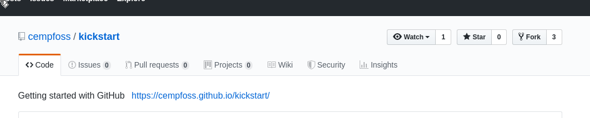
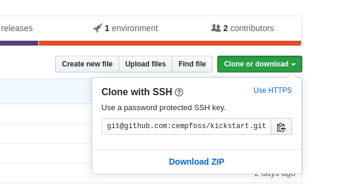
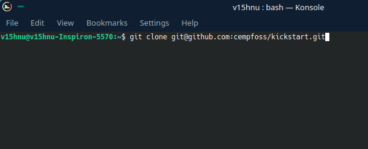
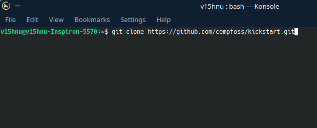

# cuP2Pond - CEMP
---------
This simple repository can help you to learn the basics of GitHub. Use the instructions given below and let's ``` Dive into Open Source```.

## Get Started

* Fork this repositor using the button given in right end of the repository name.


* Clone the repo to your local machine.

    * Open terminal and type
    * ```git clone git@github.com:cempfoss/kickstart.git```

    
    * For this to work well, you need to add your ssh key to github. Refer [GitHub Help](https://help.github.com/en/enterprise/2.15/user/articles/adding-a-new-ssh-key-to-your-github-account)
    * If you don't have an ssh key attached to your account, type the below code
    * ```git clone https://github.com/cempfoss/kickstart.git```

    
    * Now you'll be able to find the codes in your home directory.


## 💡
 Use either [atom](atom.io) (preferred) or [vscode](https://code.visualstudio.com/) as text editor.

 # Dive into the **core**
 -------------------------
* The file to be edited is ```index.html```
* ⚠️ Pull request will not be accepted if there is any wild changes in other files. If you don't have necessary knowledge in **css, javascript** better not to touch other files.
* In the ```index.html``` file,

    * Go to the ```member-list``` section. search for comment ```members details start```

    * You'll be able to see a ```div``` tag under it with ```class="card"```

    * Copy the below codes and paste it before the comment ```copy before this line```
        ```
        <div class="card">
            <h2 class="card-name">-- Your Name --</h2>
            <span>
                <i class="fa fa-github"></i>
                <a href="https://github.com/-- your profile link -- ">
                    -- Your Username --
                </a>
            </span>
        </div>
        ```

    * Make sure you replaced your name, username and GitHub profile link.

    * **Save** the file. It's done !

## Configuring GitHub profile
---------
* Open terminal and go to the project directory.

* ```git config user.email = "john@example.com"```

    * If you're using your own system, its better to config the profile gobally. For that,
    <br>```git config --global user.email="john@example.com"```


* ```git config user.name = "yourGithubUsername"```

    * Take care of the global config if  needed.

## 💡
Here, since you've cloned the repo there is no need of defining the remote origin. In normal cases where you start your own projects you will have to specify the remote origin too.

## Commiting the changes and making PR
----
* Open terminal and go to the project directory
    ```cd kickstart```

* ```git add index.html```

* ```git commit -m "john's first commit"```

    * Replace **john** with your Name

* ```git push```

    * Enter your github username and password when asked.
    * Remember command line doesn't show anything when you type a password. Not even asterisk or dots.
